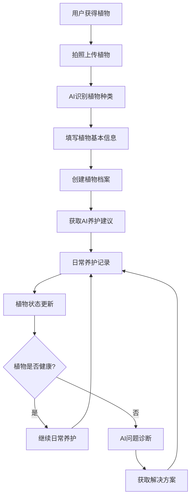
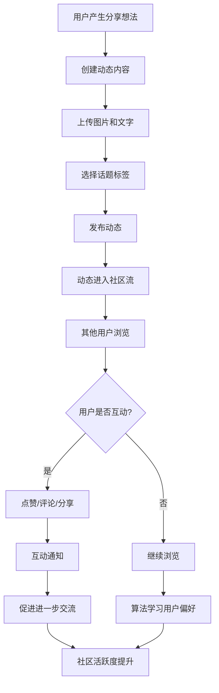
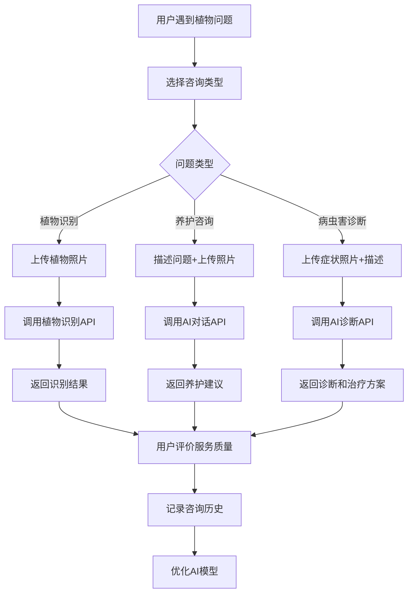
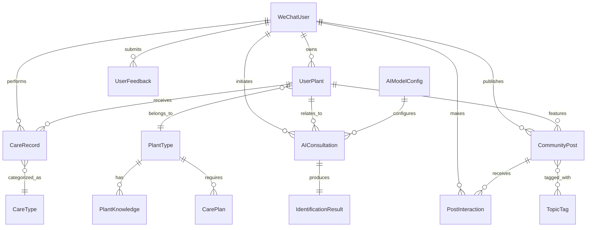

# TOGAF业务架构设计文档
## 植物养护微信小程序项目

### 文档版本信息
- **版本**: 1.0
- **创建日期**: 2024-01-30
- **架构师**: AI Assistant
- **项目**: 植物养护微信小程序
- **架构框架**: TOGAF 9.2

---

## 1. 业务架构概述

### 1.1 业务愿景
通过微信小程序平台，为全国用户提供免费的植物养护指导和社区交流服务，推广绿色生活理念，提升全民环保意识。

### 1.2 业务目标
- **主要目标**: 帮助用户成功养护植物，建立植物爱好者社区
- **次要目标**: 普及植物知识，促进环保理念传播
- **支撑目标**: 通过AI技术降低专业门槛，提供个性化服务

### 1.3 业务原则
1. **用户至上**: 所有功能设计以用户价值为中心
2. **免费公益**: 核心服务完全免费，无商业化压力
3. **AI驱动**: 依托人工智能提供专业指导
4. **社区共建**: 鼓励用户分享经验，共同成长
5. **数据安全**: 严格保护用户隐私和数据安全

---

## 2. 业务流程设计

### 2.1 核心业务流程

#### 2.1.1 用户植物管理流程

**流程名称**: 植物全生命周期管理
**流程目标**: 支持用户从获得植物到日常养护的完整管理



**活动详细描述**:

| 活动ID | 活动名称 | 活动描述 | 输入 | 输出 | 责任角色 |
|--------|----------|----------|------|------|----------|
| A01 | 植物信息录入 | 用户拍照并填写植物基本信息 | 植物照片、基本信息 | 植物档案草稿 | 用户 |
| A02 | AI植物识别 | 系统调用AI服务识别植物种类 | 植物照片 | 植物种类、置信度 | 系统 |
| A03 | 植物档案创建 | 系统创建完整的植物档案 | 用户信息、AI识别结果 | 植物档案 | 系统 |
| A04 | 养护建议生成 | AI生成个性化养护建议 | 植物种类、用户位置、季节 | 养护建议 | AI服务 |
| A05 | 养护记录管理 | 用户记录日常养护活动 | 养护类型、照片、备注 | 养护记录 | 用户 |
| A06 | 植物状态评估 | AI评估植物健康状态 | 养护记录、植物照片 | 健康评估 | AI服务 |
| A07 | 问题诊断咨询 | AI诊断植物问题并提供解决方案 | 问题描述、症状照片 | 诊断结果、解决方案 | AI服务 |

#### 2.1.2 社区互动流程

**流程名称**: 用户社区互动
**流程目标**: 促进用户间的经验分享和互助



**活动详细描述**:

| 活动ID | 活动名称 | 活动描述 | 输入 | 输出 | 责任角色 |
|--------|----------|----------|------|------|----------|
| B01 | 动态内容创建 | 用户创建包含图片和文字的动态 | 文字内容、图片、话题标签 | 动态草稿 | 用户 |
| B02 | 内容审核 | 系统自动审核内容合规性 | 动态内容 | 审核结果 | 系统 |
| B03 | 动态发布 | 系统发布动态到社区流 | 审核通过的动态 | 公开动态 | 系统 |
| B04 | 内容推荐 | 算法推荐相关内容给用户 | 用户偏好、动态内容 | 推荐列表 | 推荐算法 |
| B05 | 用户互动 | 用户对动态进行点赞、评论等互动 | 动态ID、互动类型、内容 | 互动记录 | 用户 |
| B06 | 互动通知 | 系统向动态作者发送互动通知 | 互动记录 | 通知消息 | 系统 |

#### 2.1.3 AI咨询服务流程

**流程名称**: 智能植物咨询
**流程目标**: 为用户提供专业的植物养护指导



**活动详细描述**:

| 活动ID | 活动名称 | 活动描述 | 输入 | 输出 | 责任角色 |
|--------|----------|----------|------|------|----------|
| C01 | 问题分类 | 系统根据用户输入自动分类问题类型 | 用户问题描述 | 问题分类 | 系统 |
| C02 | AI服务调用 | 系统调用相应的AI服务API | 问题内容、图片 | AI响应 | AI服务 |
| C03 | 结果处理 | 系统处理AI响应并格式化展示 | AI原始响应 | 格式化结果 | 系统 |
| C04 | 质量评价 | 用户对AI服务质量进行评价 | 服务结果 | 评价分数、反馈 | 用户 |
| C05 | 历史记录 | 系统保存咨询历史供用户查看 | 咨询内容、结果、评价 | 历史记录 | 系统 |

### 2.2 支撑业务流程

#### 2.2.1 用户管理流程
- **用户注册登录**: 微信授权登录，获取用户基本信息
- **用户信息管理**: 用户资料维护，偏好设置
- **权限管理**: 基于角色的访问控制

#### 2.2.2 内容管理流程
- **知识库维护**: AI生成植物知识内容
- **内容审核**: 自动化内容合规检查
- **内容推荐**: 基于用户行为的个性化推荐

#### 2.2.3 系统管理流程
- **数据备份**: 定期数据备份和恢复
- **性能监控**: 系统性能实时监控
- **错误处理**: 异常情况处理和恢复

---

## 3. 任务与接口映射

### 3.1 植物管理任务映射

| 任务ID | 任务名称 | 对应接口 | 接口类型 | 内聚性说明 |
|--------|----------|----------|----------|------------|
| T01 | 添加植物 | POST /api/plant/add | 创建型 | 高内聚：专注植物创建逻辑 |
| T02 | 获取植物列表 | GET /api/plant/list | 查询型 | 高内聚：专注植物查询逻辑 |
| T03 | 获取植物详情 | GET /api/plant/{id} | 查询型 | 高内聚：专注单个植物信息 |
| T04 | 更新植物信息 | PUT /api/plant/{id} | 更新型 | 高内聚：专注植物信息更新 |
| T05 | 删除植物 | DELETE /api/plant/{id} | 删除型 | 高内聚：专注植物删除逻辑 |

### 3.2 养护记录任务映射

| 任务ID | 任务名称 | 对应接口 | 接口类型 | 内聚性说明 |
|--------|----------|----------|----------|------------|
| T06 | 添加养护记录 | POST /api/care/add | 创建型 | 高内聚：专注养护记录创建 |
| T07 | 获取养护记录 | GET /api/care/list | 查询型 | 高内聚：专注养护记录查询 |
| T08 | 获取养护统计 | GET /api/care/statistics | 查询型 | 高内聚：专注统计数据计算 |

### 3.3 AI服务任务映射

| 任务ID | 任务名称 | 对应接口 | 接口类型 | 内聚性说明 |
|--------|----------|----------|----------|------------|
| T09 | 植物识别 | POST /api/ai/identify | 处理型 | 高内聚：专注植物识别逻辑 |
| T10 | AI咨询 | POST /api/ai/consult | 处理型 | 高内聚：专注AI对话逻辑 |
| T11 | 获取咨询历史 | GET /api/ai/history | 查询型 | 高内聚：专注历史记录查询 |

### 3.4 社区功能任务映射

| 任务ID | 任务名称 | 对应接口 | 接口类型 | 内聚性说明 |
|--------|----------|----------|----------|------------|
| T12 | 发布动态 | POST /api/community/post | 创建型 | 高内聚：专注动态发布逻辑 |
| T13 | 获取动态列表 | GET /api/community/posts | 查询型 | 高内聚：专注动态查询逻辑 |
| T14 | 动态互动 | POST /api/community/interact | 处理型 | 高内聚：专注互动逻辑 |

### 3.5 低耦合设计原则

#### 3.5.1 服务间解耦
- **用户服务**: 独立处理用户相关逻辑，不依赖其他业务服务
- **植物服务**: 专注植物和养护逻辑，通过用户ID关联用户服务
- **AI服务**: 独立的AI能力封装，可被多个服务调用
- **社区服务**: 独立的社交功能，通过标准接口与其他服务交互

#### 3.5.2 数据访问解耦
- **Repository模式**: 数据访问逻辑与业务逻辑分离
- **DTO模式**: 数据传输对象与实体对象分离
- **缓存抽象**: 缓存逻辑与业务逻辑分离

#### 3.5.3 外部依赖解耦
- **AI服务抽象**: 通过接口抽象，支持多种AI服务提供商
- **存储服务抽象**: 支持多种文件存储方案切换
- **消息服务抽象**: 支持多种消息推送方案

---

## 4. 业务能力地图

### 4.1 核心业务能力

```
植物养护平台核心能力
├── 用户管理能力
│   ├── 用户认证授权
│   ├── 用户信息管理
│   └── 用户行为分析
├── 植物管理能力
│   ├── 植物信息录入
│   ├── 植物档案管理
│   └── 植物状态跟踪
├── 养护服务能力
│   ├── 养护记录管理
│   ├── 养护提醒服务
│   └── 养护效果评估
├── AI智能服务能力
│   ├── 植物识别服务
│   ├── 智能咨询服务
│   └── 个性化推荐
└── 社区互动能力
    ├── 内容发布管理
    ├── 用户互动服务
    └── 社区治理
```

### 4.2 支撑业务能力

```
平台支撑能力
├── 数据管理能力
│   ├── 数据存储管理
│   ├── 数据备份恢复
│   └── 数据安全保护
├── 内容管理能力
│   ├── 多媒体处理
│   ├── 内容审核
│   └── 知识库管理
├── 系统集成能力
│   ├── 微信生态集成
│   ├── 第三方API集成
│   └── 外部服务集成
└── 运营支撑能力
    ├── 系统监控
    ├── 性能优化
    └── 用户反馈处理
```

---

## 5. 业务服务设计

### 5.1 业务服务分层

```
业务服务架构
├── 用户接口层 (User Interface Layer)
│   └── 微信小程序前端
├── 业务服务层 (Business Service Layer)
│   ├── 用户管理服务
│   ├── 植物管理服务
│   ├── 养护服务
│   ├── AI服务
│   └── 社区服务
├── 数据服务层 (Data Service Layer)
│   ├── 用户数据服务
│   ├── 植物数据服务
│   ├── 养护数据服务
│   └── 社区数据服务
└── 基础设施层 (Infrastructure Layer)
    ├── 数据库服务
    ├── 文件存储服务
    ├── 缓存服务
    └── 外部API服务
```

### 5.2 服务交互模式

- **同步调用**: 用户界面与业务服务间的实时交互
- **异步处理**: AI服务调用、图片处理等耗时操作
- **事件驱动**: 用户行为触发的推荐、通知等
- **批处理**: 数据统计、报表生成等定时任务

---

## 6. 数据模型设计

### 6.1 业务实体识别（MECE原则）

#### 6.1.1 核心业务实体

**用户域实体**
- **微信用户 (WeChatUser)**: 系统中的用户主体，通过微信授权登录
- **用户偏好 (UserPreference)**: 用户的个性化设置和偏好信息

**植物域实体**
- **用户植物 (UserPlant)**: 用户拥有的实体植物实例
- **植物类型 (PlantType)**: 植物的分类信息，用于AI识别和知识匹配
- **植物知识 (PlantKnowledge)**: 植物相关的专业知识和养护指南

**养护域实体**
- **养护记录 (CareRecord)**: 用户对植物的具体养护操作记录
- **养护类型 (CareType)**: 标准化的养护操作分类
- **养护计划 (CarePlan)**: AI生成的个性化养护建议

**AI服务域实体**
- **AI咨询 (AIConsultation)**: 用户与AI的问答交互记录
- **识别结果 (IdentificationResult)**: AI植物识别的结果数据
- **AI模型配置 (AIModelConfig)**: AI服务的配置参数

**社区域实体**
- **社区动态 (CommunityPost)**: 用户发布的社区内容
- **互动记录 (PostInteraction)**: 用户对动态的互动行为
- **话题标签 (TopicTag)**: 社区内容的分类标签

**系统域实体**
- **系统参数 (SystemParameter)**: 系统运行的配置参数
- **用户反馈 (UserFeedback)**: 用户对系统的反馈信息
- **操作日志 (OperationLog)**: 系统关键操作的审计记录

#### 6.1.2 实体关系设计



### 6.2 数据实体详细设计

#### 6.2.1 用户域数据实体

**微信用户 (T_WECHAT_USER)**
```
实体属性：
- 主键：OPENID (微信用户唯一标识)
- 基本信息：昵称、性别、地区、头像等
- 统计信息：植物数量、养护天数、活跃时间
- 状态信息：关注状态、用户分组、标签
```

**用户偏好 (T_USER_PREFERENCE)**
```
实体属性：
- 主键：PREFERENCE_ID
- 外键：OPENID (关联用户)
- 偏好设置：通知偏好、隐私设置、界面偏好
- 个性化：兴趣植物类型、养护提醒频率
```

#### 6.2.2 植物域数据实体

**用户植物 (T_USER_PLANT)**
```
实体属性：
- 主键：PLANT_ID
- 外键：OPENID (所属用户)
- 植物信息：名称、类型、品种、照片
- 获得信息：获得方式、获得日期、位置
- 状态信息：健康状态、养护难度、活跃状态
```

**植物类型 (T_PLANT_TYPE)**
```
实体属性：
- 主键：TYPE_ID
- 分类信息：科、属、种、俗名
- 特征描述：外观特征、生长习性
- 养护要求：光照、水分、温度、土壤需求
```

#### 6.2.3 养护域数据实体

**养护记录 (T_CARE_RECORD)**
```
实体属性：
- 主键：RECORD_ID
- 外键：PLANT_ID, OPENID
- 养护信息：类型、备注、照片、天气
- 时间信息：养护时间、下次建议时间
- 效果评估：植物状态变化
```

**养护类型 (T_CARE_TYPE)**
```
实体属性：
- 主键：CARE_TYPE_ID
- 类型信息：类型名称、描述、图标
- 频率建议：建议频率、季节调整
- 操作指南：标准操作步骤
```

#### 6.2.4 AI服务域数据实体

**AI咨询 (T_AI_CONSULTATION)**
```
实体属性：
- 主键：CONSULTATION_ID
- 外键：OPENID, PLANT_ID (可选)
- 问题信息：类型、文本、图片
- 回复信息：AI响应、响应时间
- 质量评估：用户评分、有效性反馈
```

**识别结果 (T_IDENTIFICATION_RESULT)**
```
实体属性：
- 主键：RESULT_ID
- 外键：CONSULTATION_ID
- 识别信息：植物类型、置信度、特征点
- 建议信息：养护建议、注意事项
```

#### 6.2.5 社区域数据实体

**社区动态 (T_COMMUNITY_POST)**
```
实体属性：
- 主键：POST_ID
- 外键：OPENID, PLANT_ID (可选)
- 内容信息：文本、图片、位置、标签
- 统计信息：浏览、点赞、评论数量
- 状态信息：发布状态、精选状态
```

**互动记录 (T_POST_INTERACTION)**
```
实体属性：
- 主键：INTERACTION_ID
- 外键：POST_ID, OPENID
- 互动信息：类型、内容、回复关系
- 时间信息：互动时间
```

### 6.3 业务规则设计 (SBVR)

#### 6.3.1 业务术语 (Business Terms)

**植物管理术语**
- **植物档案**: 用户在系统中创建的植物信息记录
- **养护记录**: 用户对植物进行养护操作的详细记录
- **AI识别**: 系统通过人工智能技术识别植物种类的过程
- **养护建议**: 基于植物类型和环境条件生成的个性化养护指导

**用户管理术语**
- **微信用户**: 通过微信授权登录系统的用户
- **用户等级**: 基于用户活跃度和贡献度的等级分类
- **社区贡献**: 用户在社区中发布内容和互动的行为

**系统服务术语**
- **AI咨询**: 用户向AI系统提出植物相关问题并获得回答的服务
- **社区动态**: 用户在社区中分享的植物相关内容
- **知识库**: 系统维护的植物相关专业知识集合

#### 6.3.2 业务事实 (Business Facts)

**用户与植物关系事实**
- 用户 拥有 植物档案
- 植物档案 属于 特定植物类型
- 用户 对植物 执行养护操作
- 养护操作 产生 养护记录

**AI服务关系事实**
- AI咨询 关联 特定用户
- AI咨询 可能关联 特定植物
- 植物识别 产生 识别结果
- 识别结果 包含 置信度信息

**社区互动关系事实**
- 社区动态 由用户发布
- 社区动态 可以关联植物
- 用户 对动态 进行互动
- 互动 包括点赞和评论

#### 6.3.3 业务规则 (Business Rules)

**植物管理规则**
```
BR001: 用户最多可以添加50个植物档案
BR002: 植物档案必须包含至少一张照片
BR003: 养护记录必须关联到存在的植物档案
BR004: 植物状态超过7天未更新时系统发送提醒
BR005: AI识别置信度低于60%时需要人工确认
```

**用户权限规则**
```
BR006: 只有植物所有者可以修改植物档案
BR007: 用户只能查看自己的养护记录
BR008: 社区动态发布需要用户身份验证
BR009: 用户可以删除自己发布的动态和评论
BR010: 系统管理员可以隐藏不当内容
```

**AI服务规则**
```
BR011: 每个用户每日AI咨询次数不超过20次
BR012: 植物识别图片大小不超过5MB
BR013: AI响应时间超过30秒时返回超时提示
BR014: 用户评分低于3分的AI回复需要人工审核
BR015: 连续3次识别失败时推荐人工客服
```

**社区管理规则**
```
BR016: 社区动态内容不得超过2000字符
BR017: 单个动态最多包含9张图片
BR018: 用户每日发布动态不超过10条
BR019: 评论内容不得超过500字符
BR020: 违规内容自动隐藏并通知管理员
```

**数据质量规则**
```
BR021: 用户昵称不得包含敏感词汇
BR022: 植物照片必须通过内容安全检测
BR023: 系统自动备份重要数据每日一次
BR024: 用户数据保留期限为账号注销后30天
BR025: 敏感操作必须记录操作日志
```

### 6.4 数据一致性保证

#### 6.4.1 引用完整性约束
- 所有外键关系必须维护引用完整性
- 级联删除策略：用户删除时相关数据软删除
- 孤儿数据清理：定期清理无效关联数据

#### 6.4.2 业务完整性约束
- 植物档案状态变更必须记录变更历史
- 养护记录时间不能早于植物获得时间
- AI咨询必须有对应的响应记录

#### 6.4.3 数据同步策略
- 用户统计信息实时更新
- 社区互动计数异步更新
- AI服务调用结果异步记录

---

## 7. 业务流程优化建议

### 6.1 用户体验优化
1. **简化操作流程**: 减少用户操作步骤，提高易用性
2. **智能化辅助**: 通过AI减少用户输入，自动填充信息
3. **个性化服务**: 基于用户行为提供个性化推荐

### 6.2 系统性能优化
1. **异步处理**: 耗时操作异步化，提高响应速度
2. **缓存策略**: 热点数据缓存，减少数据库压力
3. **CDN加速**: 静态资源全球分发，提高加载速度

### 6.3 业务流程监控
1. **关键指标监控**: 用户活跃度、功能使用率等
2. **异常流程告警**: 业务异常自动告警和处理
3. **用户反馈闭环**: 用户反馈快速响应和处理机制